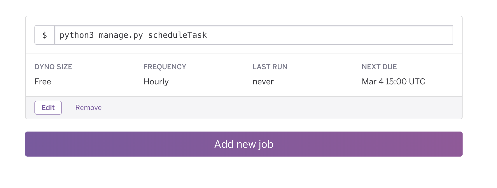

# Todolist Messenger Bot, written in Python

[](https://heroku.com/deploy)

dependencies used in the virtual_env :

`flask flask-sqlalchemy flask-script gunicorn psycopg2 flask-marshmallow requests python-dotenv flask-bcrypt marshmallow-sqlalchemy python-dotenv`

Install the app and environment :

```bash
git clone https://github.com/smolveau/TodoMessengerBot
cd TodoMessengerBot
virtualenv venv -p python3
source venv/bin/activate
pip3 install -r requirements.txt
```

Test the app :

```bash
# if the heroku toolbelt is installed
heroku local

# else if on unix
gunicorn wsgi:app

# else if on windows
python3 wsgi.py
```

Schedule a task for free every 10 minutes, every hour, or every day with heroku-scheduler :


